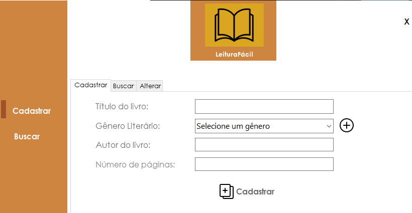

<h1 align="center">Sistema de livros para uma biblioteca/Book system for a library (In Portuguese)</h1>

Esse projeto foi feito como o trabalho final da disciplina de Linguagens I no Instituto Federal do Sul de Minas Gerais.

This project was carried out as the final work of the Languages I discipline at the Instituto Federal do Sul de Minas Gerais.

### Linguagens Utilizadas/Languages Used:
* C#
* SQL

### Ferramentas Utilizadas/Tools Used:
* Microsoft Visual Studio
* MySql Workbench
* Xampp

### Interações no software/Software interactions:
* Inserção dos livros, e dos gêneros/Insertion of books and genres
* Tela de login com senhas criptografadas/Login screen with hash passwords
* Remover ou alterar livros/Remove or change books
* Pesquisar por um livro específico/Search for a specific book

### Tela de login/Login screen:

<figure>
   
</figure>

### Tela de Cadastro/Registration Screen:

<figure>
  
</figure>

### Tela de Adicionar Categoria/Add Category Screen:

<figure>
  
</figure>

### Tela de Busca/Search Screen:

<figure>
  
</figure>

### Tela de Alteração/Change Screen:

<figure>
  
</figure>

